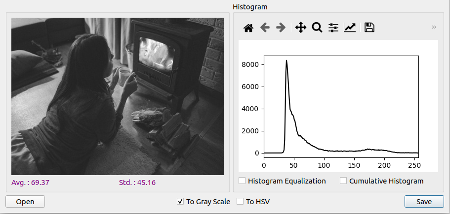
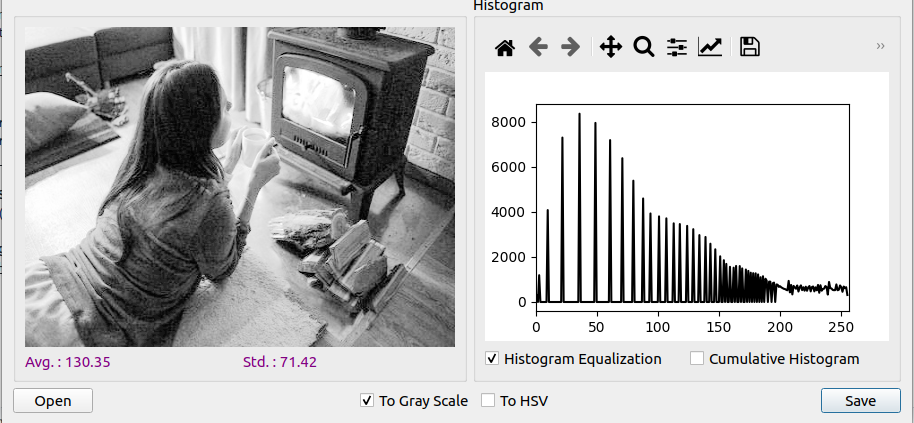
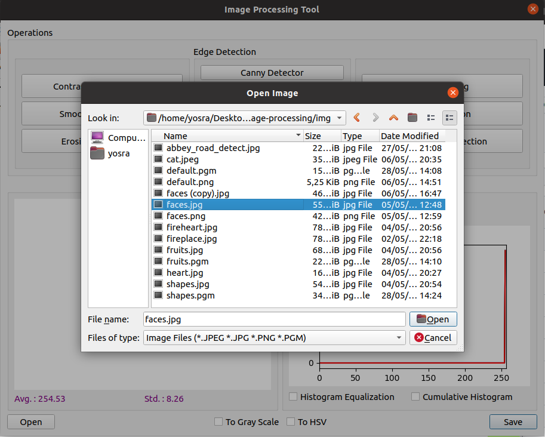
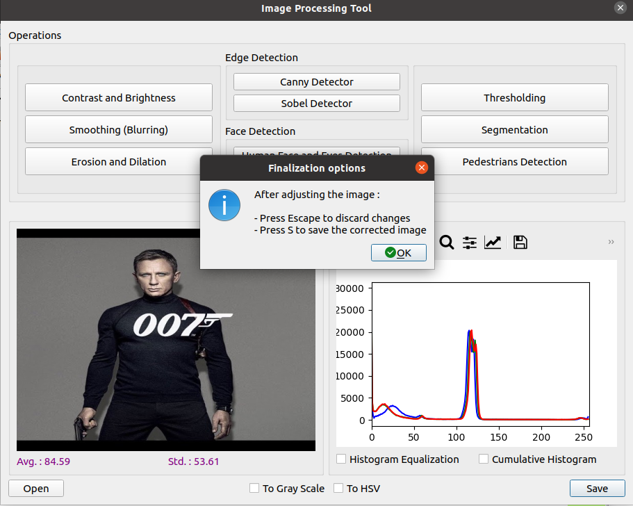
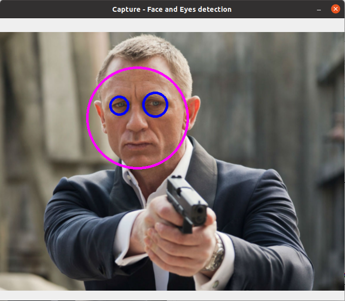
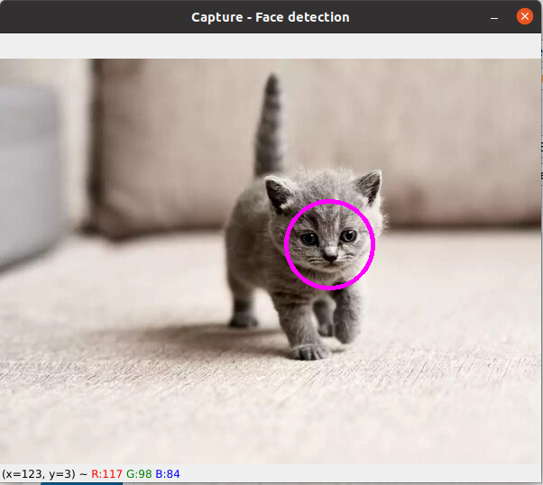

# Image Processing Tool

A graphical tool for image processing.

### Functionalities implemented 

* Basic I/O operations : open and save an image
* Statistics (Average, Std, Histogram, ...)
* Conversion to Gray Scale or to HSV
* Detection of edges, faces and people
* Segmentation using k-Means
* Threshodling
* Erosion & Dilation
* Smoothing (Blurring) using Median, Gaussian and Average Blur
* Modifcation of  Brightness & Contrast

### Conversions
#### To Gray Scale

#### To HSV

### Histogram Equalization
**Before**

**After**

### Basic I/O
#### Open an image

#### Save options

### Contrast and Brightness

### Blurring

### Erosion & Dilation

### Threshodling

### Segmentation

### Edge detection
#### Canny detector

#### Sobel detector

### Face detection
#### Human face and eyes detection

#### Cat face detection

### People detection

